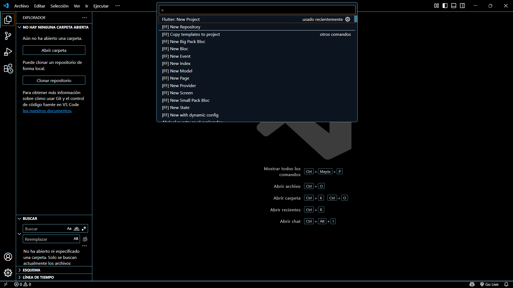
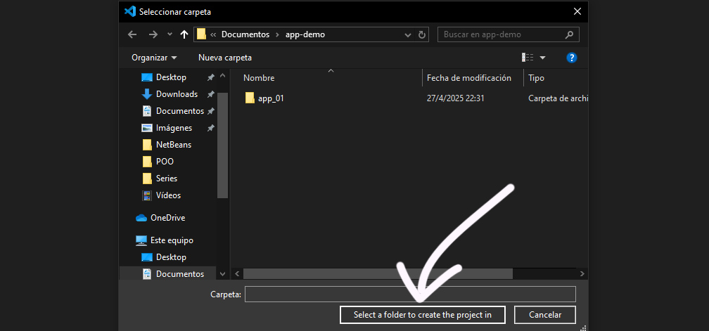
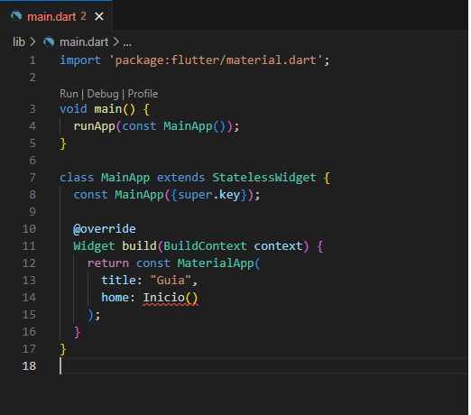
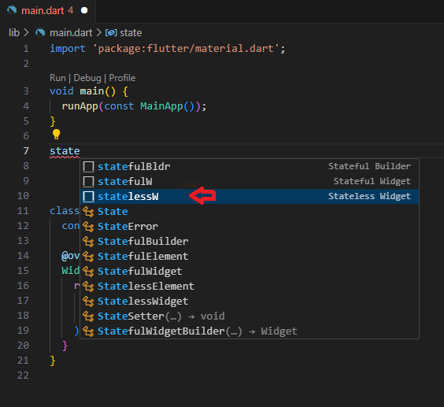
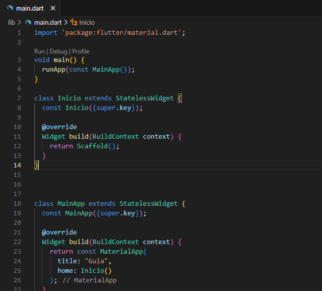
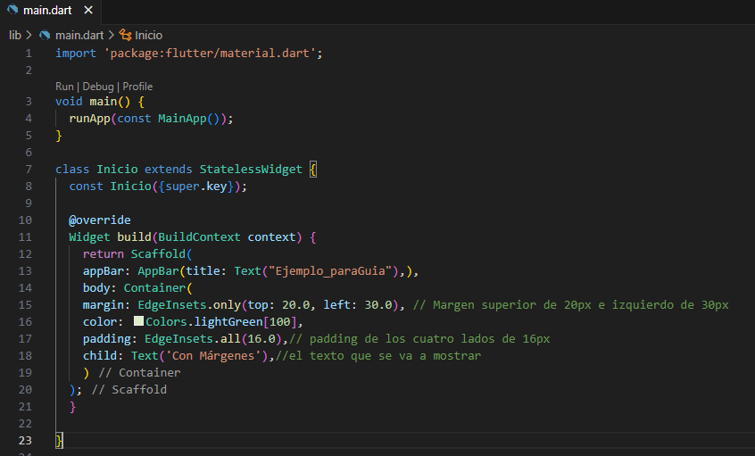
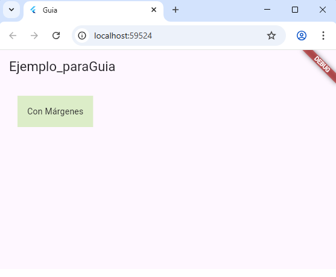

# Guia Para Crear Un Proyecto En Flutter:
## Requistos Previos:
- Tener instalado la visual studio code.
- instalar las estenciones de flutter y dart en visual studio code.
- importar las las dependecias de flutter y dark
## Paso 1:
* 1 Precionar  [ control + shitf + p ]  despues de hacer un clik en la Flutter: New Project.

## Paso 2 
* 2Crear un nuevo Proyecto al elegir New Proyect, elegimos la opcion **Empy Aplication 

## Paso 3:
3. Elegir la carpeta y nombrar el proyecto.
Luego del paso anterior, se abrira una ventana donde se debe elegir la carpeta donde se guardara el proyecto y hacemos clic en seleccionar carpeta.

## paso 4:
4. Identificar las partes del codigo.
La siguiente imagen muestra el codigo por defecto que nos da Flutter

Dentro de **Widget build(BuildContext context)** identificamos al **home** y cambiamos la palabra **Scaffold** por **Inicio**. Tambien con **title** le asignamos un titulo de encabezado al proyecto.

## Paso 5:

5 Crear un widget.
Tenemos dos tipos de Widget, los estáticos(Stateless) y dinámicos(Stateful). La eleccion de estos va a depender lo que el usuario quiera realizar.
En este caso hacemos un widget Stateless

## Paso 6:
6. Renombrar Widget.
Se debe poner el mismo nombre que en el punto 4 en home, osea "Inicio" y retornamos un **Scaffold**

## Paso 7:

7. ¡A trabajar!
Dentro del Scaffold que es donde se lleva  acabo la estructura base de la app podemos poner textos, columnas, filas, imagenes, etc.
Ejemplo:

