<font face="Pasifico"> PASO 1:</font>

<font face="Pasifico">Abrimos visual</font>
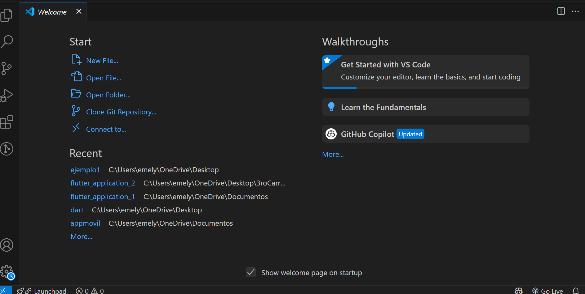

<font face="Pasifico">PASO 2:</font>

<font face="Pasifico">Colocamos el comando ctrl,shift,p</font>
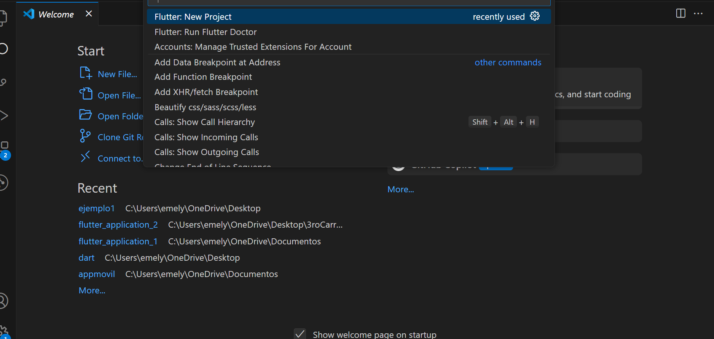

<font face="Pasifico"> PASO 3: </font>
#### colocamos new proyect seleccionamos empty application  

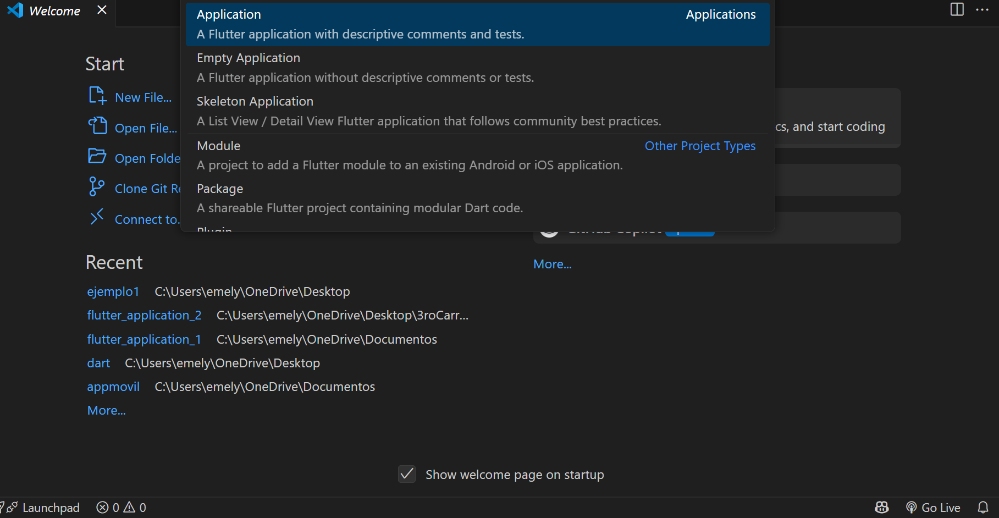

<font face="Pasifico"> PASO 4: </font>
#### Seleccionamos lugar de guardado


<font face="Pasifico"> PASO 5: </font>
#### en nuestro caso eliminar carpeta buil

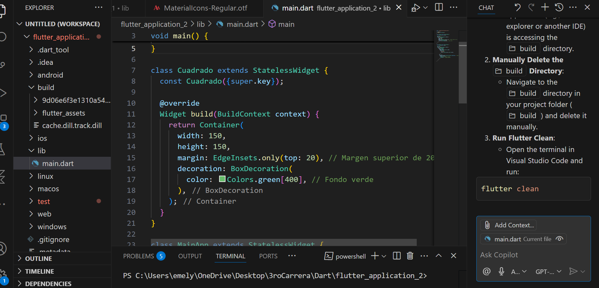

<font face="Pasifico"> PASO 6: </font>
#### descargardescargar dependencias en: 


<font face="Pasifico"> PASO 7: </font>
#### en este lugar encontramos el nombre del programa, descripcion ,seting ,sdk.


<font face="Pasifico"> PASO 8: </font>
#### esto se hace debido a errore que salen en main donde me dice que void va usar un paquete que aun no tengo la libreria
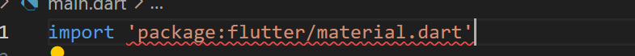

<font face="Pasifico"> PASO 9: </font>
#### para solucionar esto me voy a la terminal de la aplicacion y coloco el comando flutter pub get


<font face="Pasifico"> PASO 10: </font>
#### puede surgir un mensaje que mencione que hay nuevas actualizaciones en esas dependencias que no coincidan con la vercion del sdk no pasa nada si va a funcionar ,este mensaje puede llegar a aparecer en la terminar luego de instalar las dependencias

 <font face="Pasifico"> PASO 11: </font>
#### el paquete de flutter me trae el main que si tiene una sola linea la funcion que estoy usando me permite cambiar:

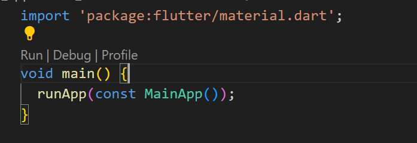
#### *por esto. main representa la clase principal,donde corre la plicacion:


####  *nosotros lo modificamos como inicio
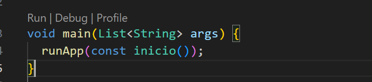


### Que tenemos en la app?

 <font face="Pasifico"> PASO 1: </font>
#### StatelesWidget que son estatcios ,no permiten cambios de estados esto se auto completa 


#### *nosotros le pusimos inicio 
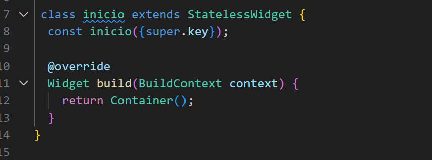


<font face="Pasifico"> PASO 2: </font>
#### StatefulWidget que son dinamicos ,si permiten cambios de estados


<font face="Pasifico"> PASO 3: </font>
####  A)  tenemos @override que se trata de sobreescribir un metodo 


####   en override tenemos:
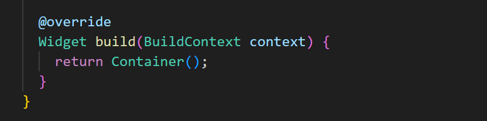
#### donde le ponemos que retorne MaterialApp :
##### donde tenemos home con el Scaffod y body con center.
     
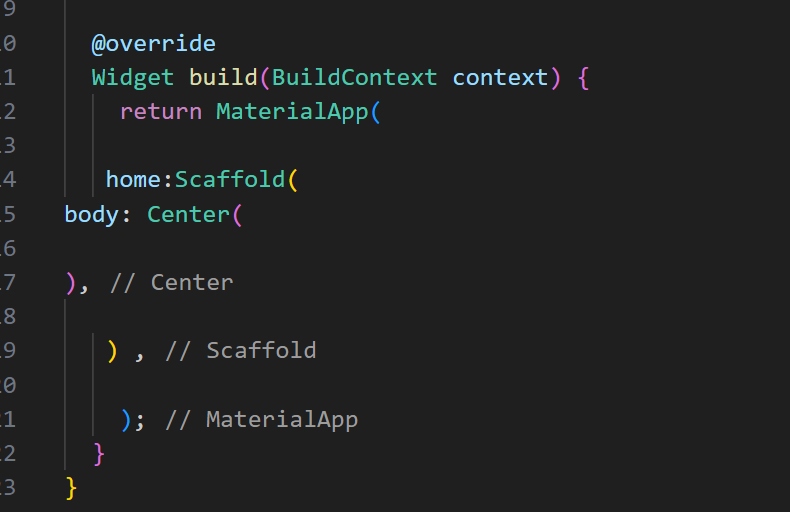


 <font face="Pasifico"> PASO 3: </font>
#### luego realizamos una super clase de nombre cuadrado(me permite tener un contenedor donde le doy forma y puedo reutilizar codigo de forma) fuera de inicio(que me permite dar inicio a mi aplicacion)
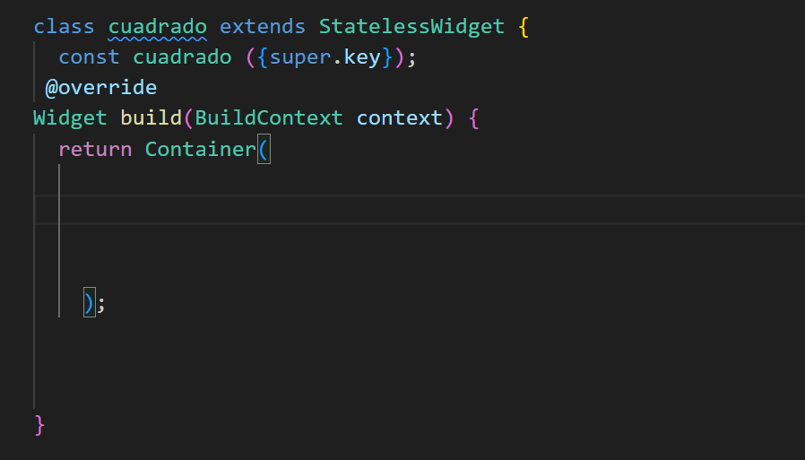


<font face="Pasifico"> PASO 4: </font>
#### hay le ponemos dise;o
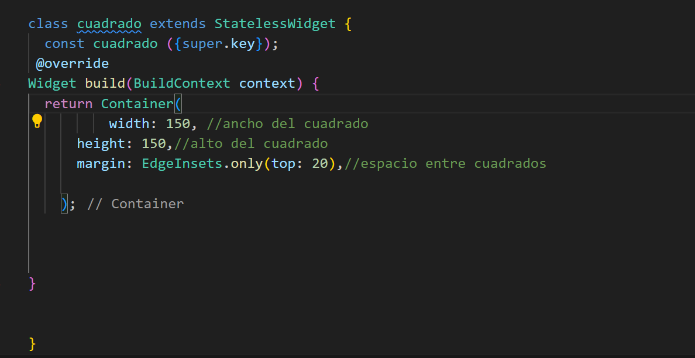


<font face="Pasifico"> PASO 5: </font>
#### anadimos color 
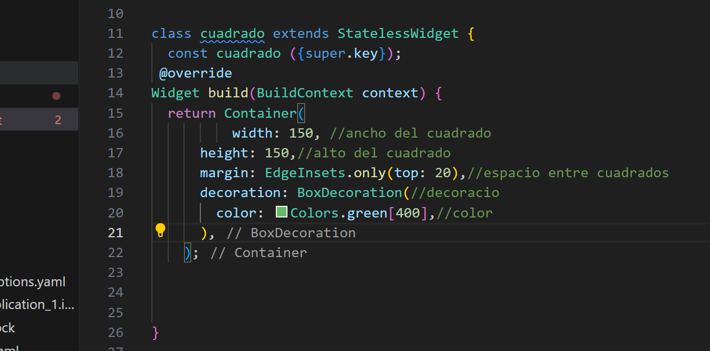

<font face="Pasifico"> PASO 6: </font>
#### colocamos el AppBar (parte superior)
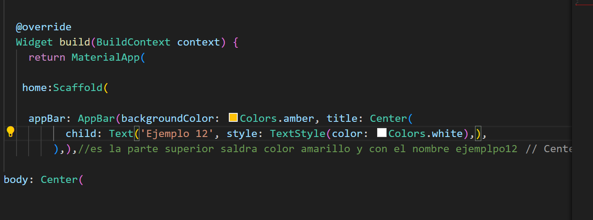

<font face="Pasifico"> PASO 7: </font>
#### intercambiamos certer por row 
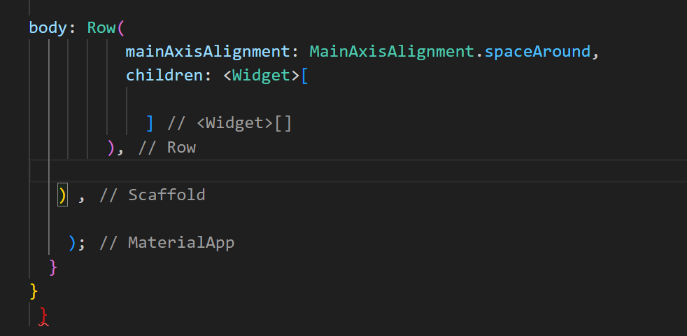

<font face="Pasifico"> PASO 8: </font>
#### a esto le agregamos el contenedor de la clase cuadrado 
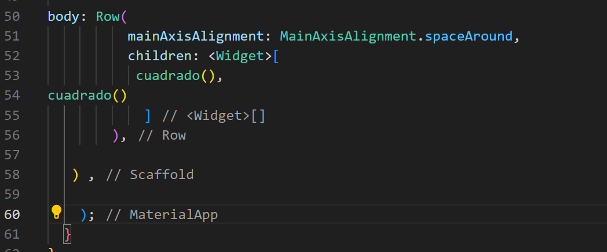


#### Damos por finalizada esta gia( trabajo practico hecho por Emely Dominguez y Quiroga Santigo)

##### Dejamos codigo de muestra !!!
<font face="Pasifico"> Codigo ejemplo : </font>

``` dart

import 'package:flutter/material.dart';

void main(List<String> args) {
  runApp(const inicio());
}


class cuadrado extends StatelessWidget {
  const cuadrado ({super.key});
 @override
Widget build(BuildContext context) {
  return Container(
          width: 150, //ancho del cuadrado
      height: 150,//alto del cuadrado
      margin: EdgeInsets.only(top: 20),//espacio entre cuadrados
      decoration: BoxDecoration(//decoracio 
        color: Colors.green[400],//color
      ),
    );


}


}

 class inicio extends StatelessWidget {
  const inicio({super.key});


  @override
  Widget build(BuildContext context) {
    return MaterialApp(
   
   home:Scaffold(

    appBar: AppBar(backgroundColor: Colors.amber, title: Center(
          child: Text('Ejemplo 12', style: TextStyle(color: Colors.white),),
        ),),//es la parte superior saldra color amarillo y con el nombre ejemplpo12

body: Row(
          mainAxisAlignment: MainAxisAlignment.spaceAround,
          children: <Widget>[
           cuadrado(),
cuadrado()
            ]
        ),

   ) ,

    );
  }
}
 ```


#### Codigo de muestra calculadora : 

``` dart

 import 'package:flutter/material.dart';
void main() => runApp(CalculadoraQuirogaDominguez());

class CalculadoraQuirogaDominguez extends StatelessWidget {
  @override
  Widget build(BuildContext context) {
    return MaterialApp(
      home: CalculadoraPage(),
      debugShowCheckedModeBanner: false,
    );
  }
}

class CalculadoraPage extends StatefulWidget {
  @override
  _CalculadoraPageState createState() => _CalculadoraPageState();
}

class _CalculadoraPageState extends State<CalculadoraPage> {
  String numero = '';
  double resultado = 0;
  String operador = '';
  double primerNumero = 0;

  void presionarNumero(String valor) {
    setState(() {
      numero += valor;
    });
  }

  void presionarOperador(String op) {
    setState(() {
      primerNumero = double.parse(numero);
      operador = op;
      numero = '';
    });
  }

  void calcularResultado() {
    double segundoNumero = double.parse(numero);
    if (operador == '+') {
      resultado = primerNumero + segundoNumero;
    } else if (operador == '-') {
      resultado = primerNumero - segundoNumero;
    } else if (operador == '*') {
      resultado = primerNumero * segundoNumero;
    } else if (operador == '/') {
      resultado = segundoNumero != 0 ? primerNumero / segundoNumero : 0;
    }

    setState(() {
      numero = resultado.toString();// numero contiene el resultado como cadena de texto con toString
    });
  }//fin de la funcion resultado

  void limpiar() {
    setState(() {
      numero = '';
      operador = '';
      primerNumero = 0;
      resultado = 0;
    });
  }
   
  
  Widget boton(String texto, VoidCallback funcion,
      {Color colorFondo = Colors.indigo, Color colorTexto = Colors.white}) {
    return ElevatedButton(
      onPressed: funcion,
      style: ElevatedButton.styleFrom(
        backgroundColor: colorFondo,
        padding: EdgeInsets.symmetric(horizontal: 90, vertical: 40),
        shape: RoundedRectangleBorder(borderRadius: BorderRadius.circular(20)),
      ),
      child: Text(
        texto,
        style: TextStyle(fontSize: 24, color: colorTexto),
      ),
    );
  }

 @override
Widget build(BuildContext context) {
  return Scaffold(
    backgroundColor: Colors.black,
    appBar: AppBar(
    title: Center(
          child: Text('Calculadora de Dominguez y Quiroga',style: TextStyle(color: Colors.white)),
        ),
      backgroundColor: Colors.black,
    ),
    body: Column(
      mainAxisAlignment: MainAxisAlignment.center,
      children: [


        // Pantalla de la calculadora


        Container(//muestra el resultado osea primero los numero que se ingresan y finalmente muestra el resultado
          padding: EdgeInsets.all(16),
          alignment: Alignment.centerRight,
          child: Text(
            numero,
            style: TextStyle(fontSize: 48, color: Colors.white),
            textAlign: TextAlign.right,
          ),
        ),
      


        SizedBox(height: 20),
        // Botones de la calculadora
        Column(
          children: [
            Row(
              children: [
                Expanded(child: boton('1', () => presionarNumero('1'))),//funcion que guarda valor transforma a texto numero y luego texto cuando se preciona un operador matematico ,ese resultado se guarda en variable numero 
                Expanded(child: boton('2', () => presionarNumero('2'))),
                Expanded(child: boton('3', () => presionarNumero('3'))),
                Expanded(
                  child: boton('+', () => presionarOperador('+'),//operador matematico que permite limpiar numero y cuando se precione un nuevo numero se guarda en variable numero
                      colorFondo: Colors.orange),
                ),
              ],
            ),
            SizedBox(height: 10),
            Row(
              children: [
                Expanded(child: boton('4', () => presionarNumero('4'))),
                Expanded(child: boton('5', () => presionarNumero('5'))),
                Expanded(child: boton('6', () => presionarNumero('6'))),
                Expanded(
                  child: boton('-', () => presionarOperador('-'),
                      colorFondo: Colors.orange),
                ),
              ],
            ),
            SizedBox(height: 10),
            Row(
              children: [
                Expanded(child: boton('7', () => presionarNumero('7'))),
                Expanded(child: boton('8', () => presionarNumero('8'))),
                Expanded(child: boton('9', () => presionarNumero('9'))),
                Expanded(
                  child: boton('*', () => presionarOperador('*'),
                      colorFondo: Colors.orange),
                ),
              ],
            ),
            SizedBox(height: 10),
            Row(
              children: [
                Expanded(
                  child: boton('C', limpiar, colorFondo: Colors.red),//limpia las variables de (numero,operaador,resultado y primer numero) funcion limpiar que permite volver a cargar numeros y realizar una nueva operacion
                ),
                Expanded(child: boton('0', () => presionarNumero('0'))),
                Expanded(
                  child: boton('=', calcularResultado,// calcula el resultado de la funcion con un caso si el operador precionado es tanto hace tanto se guarda en variable resultado que despues se iguala a variable numero y finalmente se muestra en container
                      colorFondo: Colors.green),
                ),
                Expanded(
                  child: boton('/', () => presionarOperador('/'),
                      colorFondo: Colors.orange),
                ),
              ],
            ),
          ],
        ),
      ],
    ),
  );
}
} 

