# Guia para creación de App en Flutter

## Paso 1_ Abrir Visual Studio Code y en “buscar”, seleccionar “mostrar y ejecutar comandos” o usar la combinación Crtl+Shift+P
 
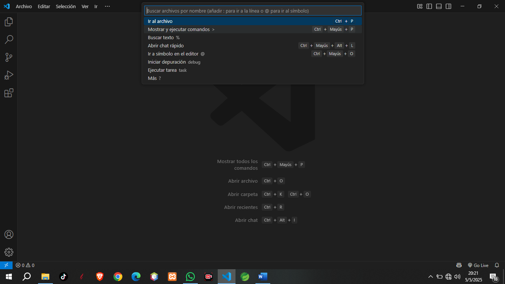

## Paso 2_Seleccionar Flutter: New Project

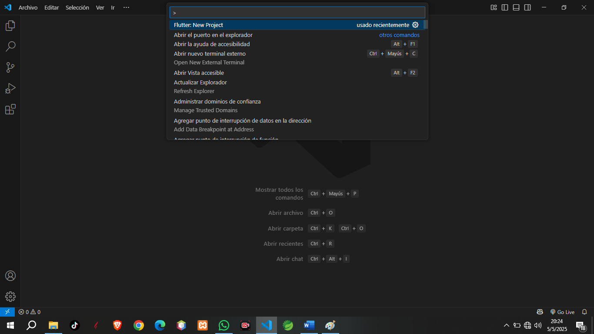
 
## Paso 3_Seleccionar “Empty Application”

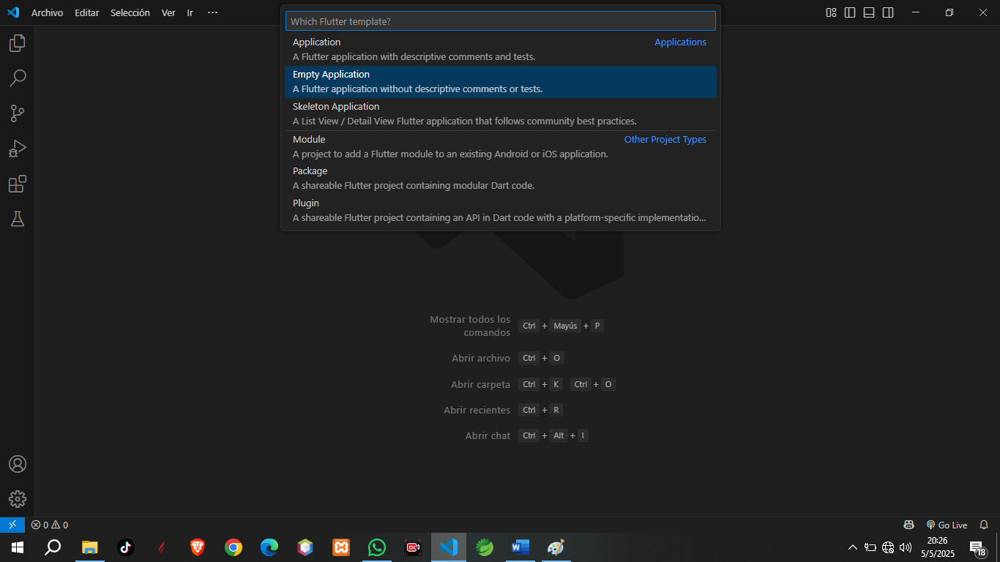
 
## Paso 4_Seleccionar carpeta donde se guardará la aplicación
 
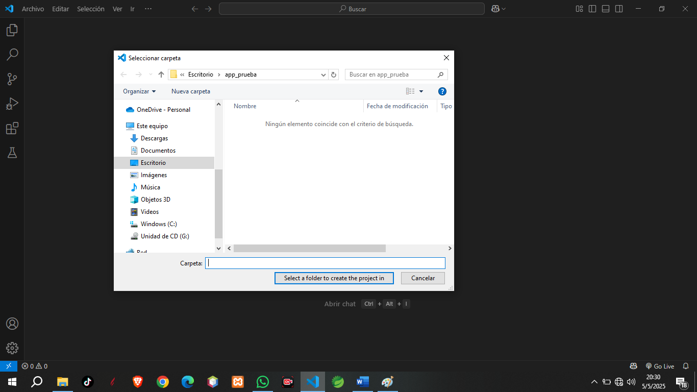

## Paso 5_Ingresar el nombre del proyecto sin espacios ni mayúsculas (Ej. “app_01”)
 
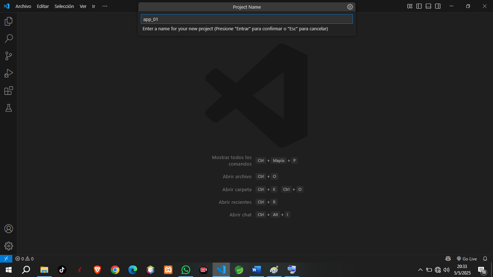

## Paso 6_En el archivo main.dart crear un stateless widget para el inicio, (fuera de de clase MainApp) y referenciarla en el home de MaterialApp.

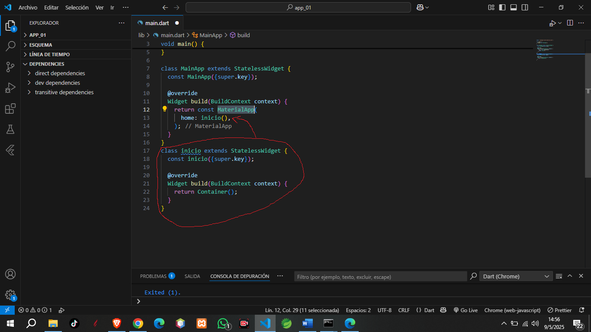
 
## Paso 7_Agregar titulo para la aplicación

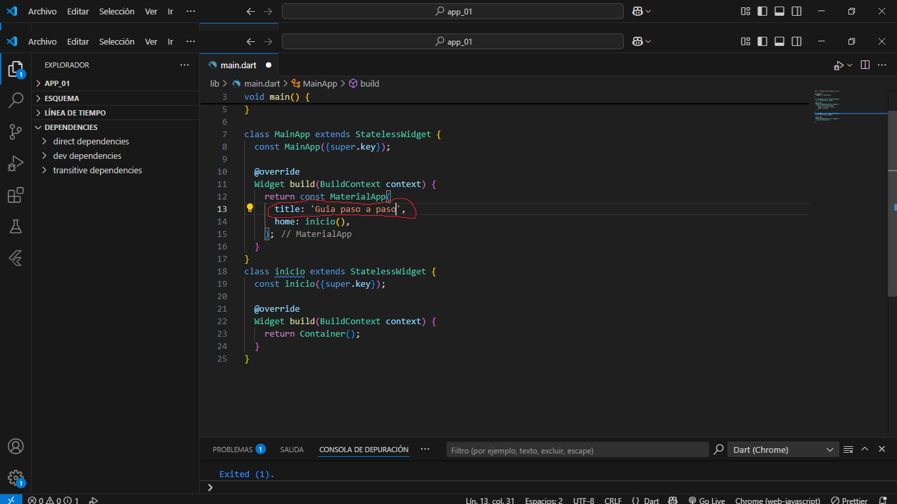
 
## Paso 8_En el widget build de Inicio crear un Scaffold, conteniendo un Appbar y un Body
 
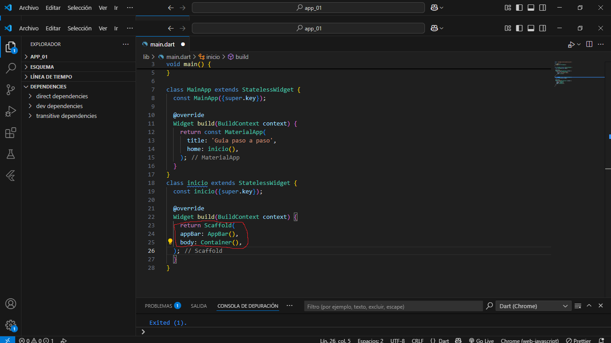

## Paso 9_Agregar titulo al Appbar
 
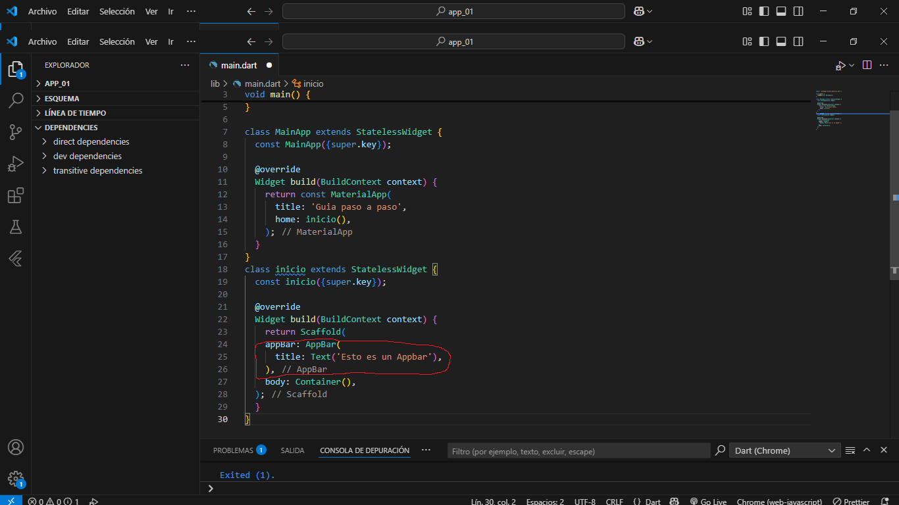

## Paso 10_En el body agregar Row() o Column()

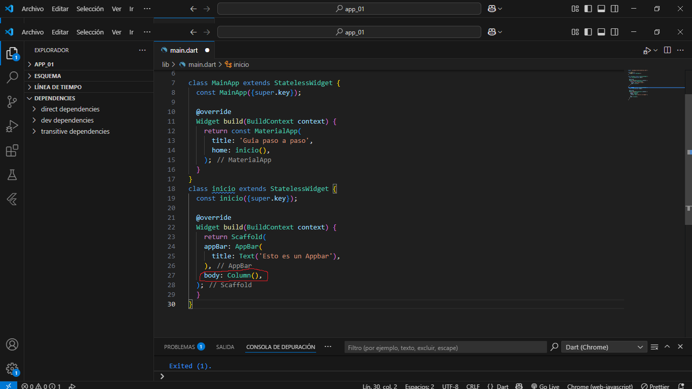
 
## Paso 11_Dentro de Row() o Column(), agregar Child, en caso de necesitar un solo elemento o Chidren, en caso de varios

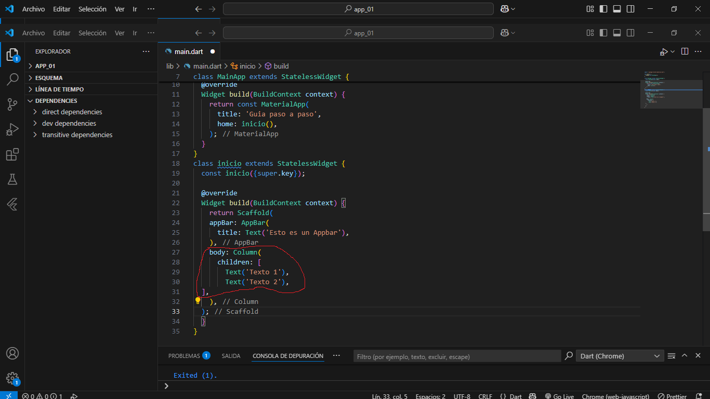
  
## Paso 12_Agregar modificadores/propiedades a Row o Column, según el caso

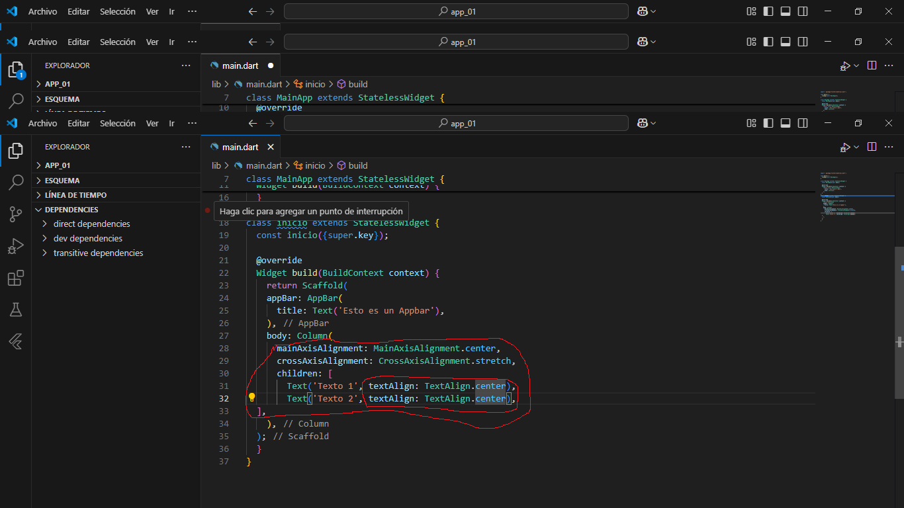
 
## Paso 13_Para crear un Widget dentro de un Row() o Column(), declararlo con todos sus atributos y parámetros, fuera de toda clase y refenciarlo con el nombre, seguido de paréntesis abriendo y cerrando o sea ()

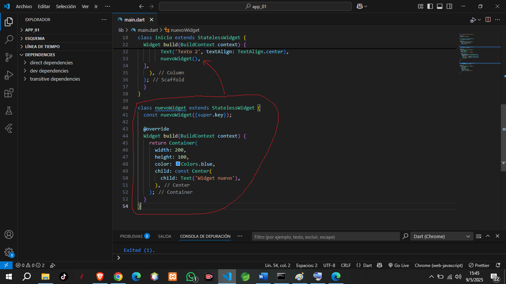
 
## Vista Final:

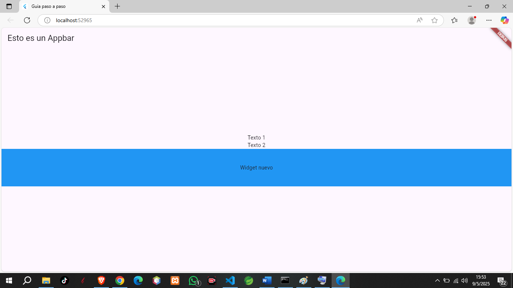
 
